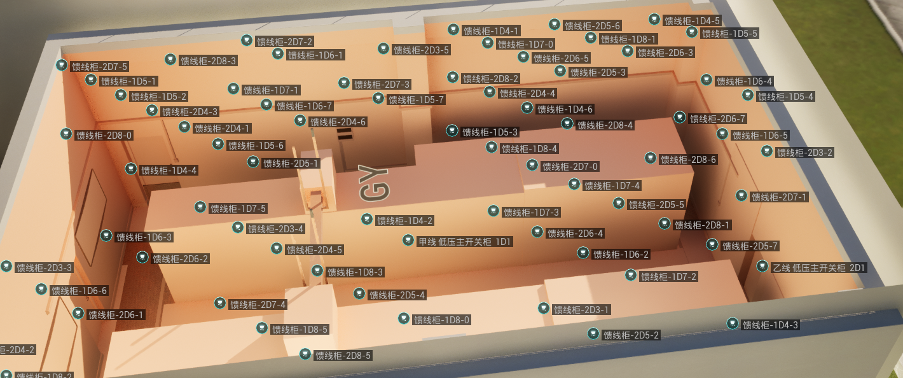

# Python Webserver

基于Webserver的Python和UE交互工具

- 将蓝图或中台不便完成的任务交给Python处理
- 可以使用Python中强大的第三方库
- 无需等待编译

## 如何使用

 继承 `Webserver.py` 中的 `WebSocketServer` 类并重写其方法。

 这个类提供了基本的异步监听-通信逻辑，根据需求扩展子类的功能。

## 示例工程

### 一个使用numpy和opencv批量计算房间形状并撒点的样例

- Demo/AlgorithmTools.py 一些调用第三方工具进行几何处理的数学方法
- Demo/DataJson.py 定义了此任务中的一些数据结构和键值表
- Demo/BatchGen.py 工具主体。读取外部文件，根据输入向UE发Json消息，收到消息后调用对应函数处理。

1. 运行BatchGen.py，内部server自动监听直到UE启动
2. 使用`collect`命令调用UE接口收集房间信息
3. 使用`set`命令在UE中进行撒点预览
4. 使用`file`命令将结果保存到文件

本示例中，格式的拼接是在Python方法内完成的，你可能需要按需修改。

#### 一个房间内均匀放置设备标签

#### 建筑对应位置生成500+设备标签

